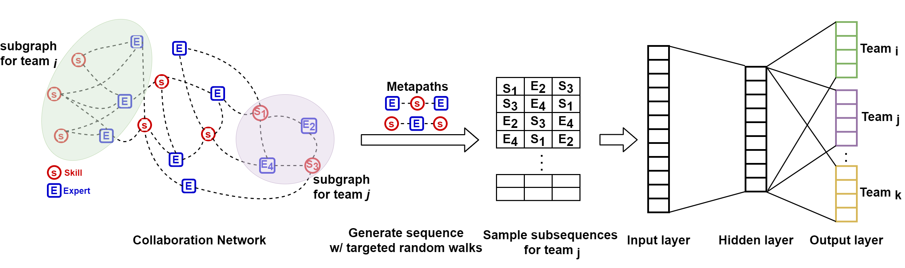

# Subgraph Representation Learning for Team Retrieval

## Introduction
Team retrieval is concerned with the identification of a group of experts that are able to collaborate with each other in order to collectively cover a set of required skills. This problem has mainly been addressed either through graph search, which looks for subgraphs that satisfy the skill requirements, or through neural architectures that learn a mapping from the skill space to the expert space. An exact graph-based solution to this problem is intractable and its heuristic variants are only able to identify sub-optimal solutions. On the other hand, neural architecture-based solutions are prone to overfitting and simplistically reduce the problem of team formation to one of expert ranking. Our work in this paper proposes an unsupervised heterogeneous skipgram-based subgraph retrieval approach that can learn representations for subgraphs in a collaboration network. Unlike previous work, the subgraph representations allow our method to mine teams that have past collaborative history and collectively cover the requested desirable skills. Through our experiments, we demonstrate the our proposed approach is able to outperform a host of state of the art team retrieval techniques from both quantitative and qualitative perspectives.

## Requirements

- Python >= 3.6.
- Numpy
- Scikit Learn
- Tensorflow >= V1.4
- Keras
- Stellargraph 

## Before Training!
The preprocessed dataset is already included in the dataset folder. If you want to run the preproces yourself of modify the procedure, you need to download it and place it dataset folder.

We consider the paper authors to represent experts, the set of authors on each paper to form a team, and the top-2000 unigrams, bigrams and trigrams with the highest tf-idf values to constitute the set of skills. Our dataset consists of 33,002 papers (teams), 2,470 authors (experts) and 2,000 skills. We split the 33,002 papers in the dataset based on a ten-fold cross-validation strategy in our experiments

## Usage Instructions

I. Training
First, you need to prepare the subgraphs and generate initial embeddings. The neural network training is included in Jupyter notebook. The Jupyter notebook includes:

  * Data import/export
  * Heterogeneous graph generator
  * Training the Neural Model
  * exporting embeddings and predictions
  

Use [subgraph_embedding.ipynb](/implementation/subgraph_embedding.ipynb) Jupyter notebook inside the [implementation](/implementation) folder to initiate embeddings for training the neural network model.

II. Testing
For further training or generate predictions, you should run [model_trainer.py](/implementation/model_trainer.py).
After running the file, the predictions will be generated using the train/test split provided.

## Embeddings
Embedding reuslts can be found under [embeddings](/implementation/embeddings) folder in implementation directory.

## Evaluation
Using the [banchmark.py](/util/) in **util folder** , you can evaluate the proposed model with its variants or baselines. Samples for each of the modes are brought below:

### Ablation study
We first perform an ablation study to investigate the impact of the variations that can be built based on our approach. To this end, we substitute the subgraph representation learning component of our architecture with a node-based heterogeneous graph representation learning technique. We further implement a supervised variation of our method where the representation of the subgraphs or nodes are used to learn a mapping between the skill and expert spaces. 
This creates four variations of our work that we study: 
1. proposed work in this paper, i.e., unsupervised subgraph representations (usg)
2. unsupervised heterogeneous node representations (uhn)
3. supervised mapping with subgraph representations (smsg) 
4. supervised mapping with heterogeneous node representations (smhn)

 

### Baselines
Predictions can be evaluated using the codes provided in eval folder. All the reported numbers/charts can be reproduced by running the **"banchmark.py"** python file in [util](/util) directory.
For each of the methods, an individual csv file will be generated respectively. You can modify list of evaluating methods in the **"banchmark.py"** file under the "file_names" variable. Please take note that for each of the methods, their prediction output file must be avaialble in the [predictions](/implementation) folder under the **results** directory. Comparison file will generate following IR-related metrics for the desired **k**:

 

### Qualitative

We further compare the performance of our proposed approach on quality metrics with the strongest baselines. The quality metrics include (1) skill coverage (sk) that considers the extent to which the proposed team is able to cover the requested skills and (2) team comparability (tc), which measures how similar the selected team members are compared to the members of the expected team. A high quality team would be one that has a high sk measure (sk=1 is when all skills are covered) and a low team comparability value (tc=0 shows there are no differences between the average h-index of the proposed and expected teams).

### Help-Hurt Diagram
Compare the performance of our approach with the best two baselines. Numbers required for the Help-Hurt diagram are generated using by **"HelpHurt.py"** file. After running the file, a csv file will be available in [scores](/results/) folder under output directoy.
You can then use the results in csv file to plot the diagram. For example:

## Note
In this paper, we have modeled the problem of team retrieval through a subgraph representation learning process, which adopts a heterogeneous skipgram architecture. The advantage of our proposed approach is that it is quite light-weight, preserves the semantics of team structure, past collaboration experience between the experts and the relation between experts and skills. Based on our experiments on the DBLP dataset, we have shown that the proposed approach is able to show improved performance over the state of the art graph-based and neural architecture-based methods.
